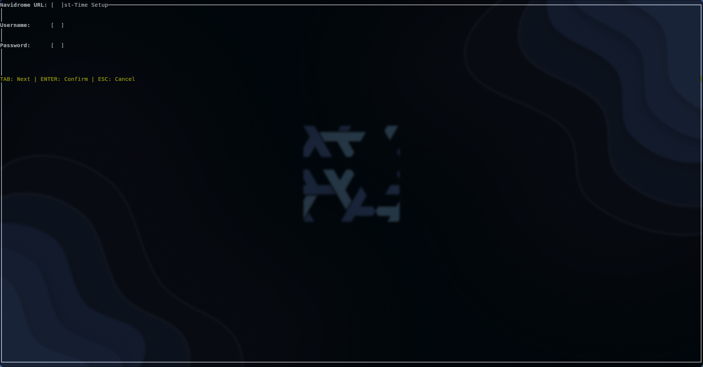
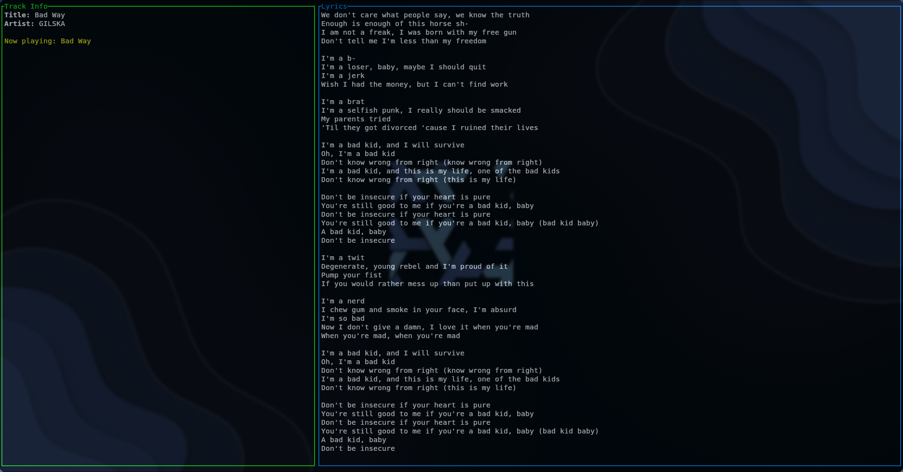

# Sonix Lyrics

A fast terminal-based synced lyrics + karaoke client for Navidrome (Subsonic API) built in Rust with Ratatui. Functional today with Subsonic-compatible servers only.





---

## Features

- **Real-time synced lyrics (LRC)**
- **Karaoke mode** (word-by-word) — currently disabled while we fix stability issues
- Auto-detects currently playing track from **Navidrome** (Subsonic API)
- Smooth, drift-free playback timer — currently disabled because it is very buggy
- Clean TUI using Ratatui + Crossterm
- Fully configurable via `config.conf`
- Works without `.env` files
- Logging to `sonix_lyrics.log`

---

## TODO / Known Issues

- Fix karaoke sync/highlighting so the feature can be turned back on by default.
- Rework the smooth playback timer so it no longer drifts and can be re-enabled safely.

---

> **Note:** Sonix Lyrics currently ships and is actively tested on Nix. It should work on other Linux distributions, but there may be rough edges until verified. Please report any distro-specific issues.

## Installation

Ensure you have a recent Rust toolchain (stable) installed via [`rustup`](https://rustup.rs/) so `cargo build` and `cargo run` are available.

### **Clone the repository**

```bash
git clone https://github.com/EasyCanadianGamer/sonix_lyrics.git
cd sonix_lyrics

# Run with cargo (requires Rust toolchain)
cargo run


###  Configuration

Create a file named:

`config.conf`

in the same directory as the binary.
Example:

```ini
# Sonix Lyrics Configuration

# Navidrome Server Info
NAVIDROME_URL = https://your.navidrome.server
NAVIDROME_USER = your_user
NAVIDROME_TOKEN = your_token
NAVIDROME_SALT = your_salt

# TUI Refresh Interval (seconds)
REFRESH_INTERVAL = 2

# Enable Karaoke Word Highlighting
KARAOKE_ENABLED = false
```

### Easy Install

Go to the latest release and just download the binary

## Usage

Start the TUI:

```bash
./sonix_lyrics
```

The config is in:

```bash
~/.config/sonix_lyrix/config.conf
```

Controls:


| Key    | Action             |
| -------- | -------------------- |
| q      | Quit               |
| r      | Refresh metadata   |
| j / ↓ | Scroll lyrics down |
| k / ↑ | Scroll lyrics up   |

---

## Project Structure

```
assets/
  ├─ videos/images for readme
script/
  ├─ build-release.sh  # Build script
src/
  ├─ main.rs      # TUI runtime
  ├─ navidrome.rs  # Navidrome API
  ├─ lyrics.rs     # Lyrics fetching + parsing
  ├─ config.rs     # Config loader/config creation
  ├─ setup.rs     # setup tui
config.conf       # User configuration
LICENSE           # MIT license
README.md         # This file
```

---

## License

This project is licensed under the MIT License — see [LICENSE](./LICENSE)

---

## Contributing

Pull requests and improvements are welcome.
Feel free to open issues or feature requests.
Check more at [CONTRIBUTION.md](./CONTRIBUTION.MD)

---

## Credit

Made by CanadianGamer ( so far but willing to add more contributors)
Powered by:

- Rust
- Ratatui
- Crossterm
- Subsonic API
- LRC sources from lrclib.net
